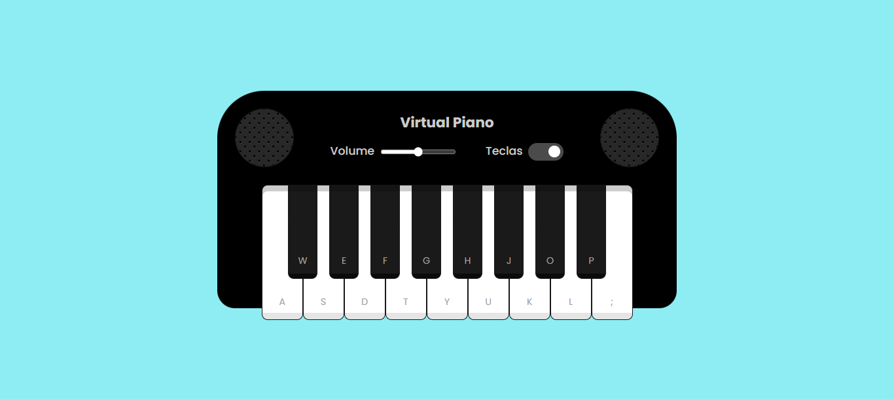

# 🎹 VIRTUAL PIANO

Teclado de música virtual criado para o desafio de projeto do Bootcamp de Desenvolvimento de Jogos da Dio em parceria com o iFood.

## Como usar?

Basta clicar numa tecla com o mouse ou a letra do teclado indicada. Além disso você tem ajustes de volume e exibir ou não as teclas do teclado, caso queria um layout mais limpo.

## Sobre o projeto...

O projeto foi desenvolvido em Javascript com HTML e CSS, possui interface apenas para desktop.

## Imagem do projeto

